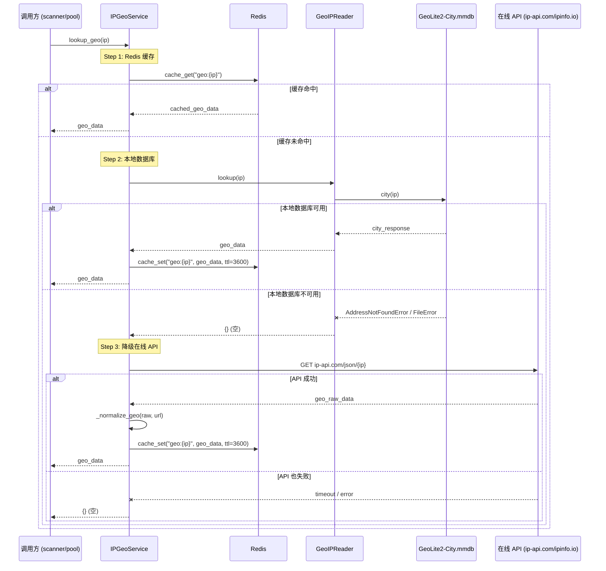
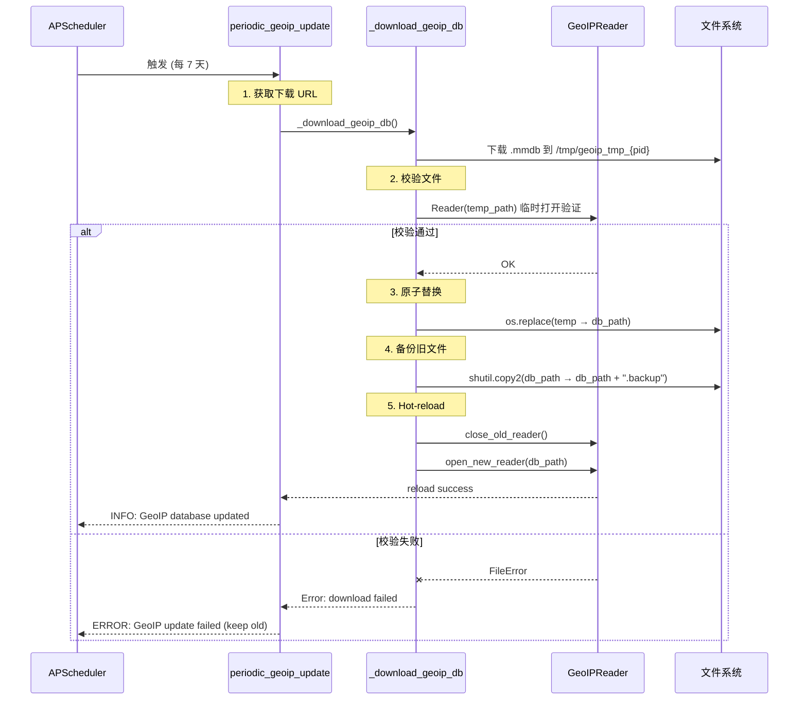
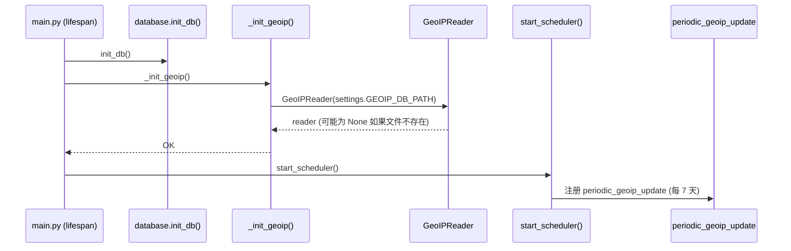
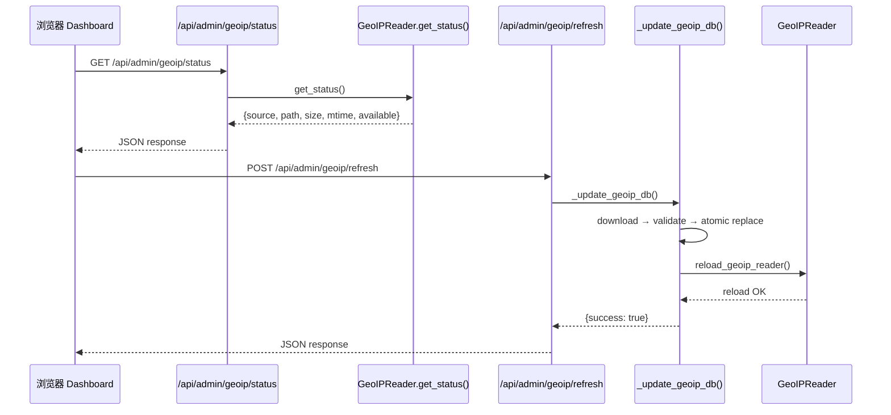
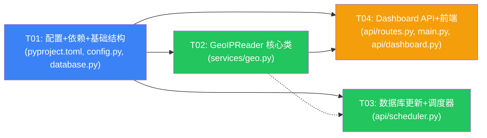

# PyProxyPool GeoIP 本地数据库集成 — 架构设计文档

> 版本：v1.0 | 日期：2026-06-10 | 作者：Bob (Architect)

---

## 1. 实现方案

### 1.1 核心技术挑战

1. **同步 vs 异步**：`geoip2.database.Reader` 是纯同步 API，而 `IPGeoService` 整体是 async 架构。需要在不阻塞 event loop 的前提下调用同步方法。
2. **原子替换**：数据库更新（下载 → 替换 → hot-reload）需要在不停机的情况下安全替换 `.mmdb` 文件。
3. **三层降级**：Redis 缓存 → 本地数据库 → 在线 API，每个环节都需要优雅的 fallback。
4. **向后兼容**：`models.py`、`pool.py`、`scanner.py` 不得修改；`enrich_proxy_geo()` 中 `geo_data.get('org', '')` 映射到 ISP 的行为必须保留。

### 1.2 框架选型

| 组件 | 选择 | 理由 |
|------|------|------|
| GeoIP 查询 | `geoip2>=4.8.0`（MaxMind 官方库） | 标准 `.mmdb` 格式，成熟稳定 |
| 数据库源 | P3TERX 社区镜像 | 无需 License Key，免注册 |
| 文件下载 | 复用 `aiohttp` | 项目已有，无需新增 HTTP 库 |
| 热重载 | 关闭旧 `Reader` → 打开新 `Reader` | `geoip2` Reader 打开速度快（~50ms），无状态 |
| 原子替换 | 临时文件 + `os.replace()` | 跨平台原子操作 |

### 1.3 架构模式

**三层降级查询链路**（核心设计）：

```
Client
  │
  ▼
IPGeoService.lookup_geo(ip)   ← async 接口，对调用方透明
  │
  ├── Step 1: Redis cache_get(f"geo:{ip}")  → 命中则直接返回
  │
  ├── Step 2: GeoIPReader.lookup(ip)        ← 本地 .mmdb 文件
  │           ├── 文件不存在 → 降级 Step 3
  │           ├── 文件损坏 → 降级 Step 3
  │           ├── 查询不到 → 降级 Step 3
  │           └── 查到 → 写 Redis cache_set → 返回
  │
  └── Step 3: _query_geo_api(ip)            ← ip-api.com / ipinfo.io
          ├── 写入 Redis cache_set
          └── 返回
```

**数据库更新流程**：

```
APScheduler (每 7 天 / 手动触发)
  │
  ▼
periodic_geoip_update()
  │
  ├── 1. 下载最新 .mmdb 到临时文件
  ├── 2. 校验：文件大小 > 0 + geoip2.Reader 能打开
  ├── 3. 原子替换：os.replace(temp_path, db_path)
  ├── 4. 备份旧文件：db_path → db_path + '.backup'
  └── 5. Hot-reload：关闭旧 Reader，打开新 Reader
```

---

## 2. 系统架构图

```mermaid
graph TB
    subgraph Client["调用方 (scanner / pool / API)"]
        A[IPGeoService.lookup_geo]
        B[enrich_proxy_geo]
    end

    subgraph Cache["Redis 缓存"]
        C[(geo:{ip} TTL=3600s)]
    end

    subgraph LocalDB["本地 GeoIP 数据库"]
        D[GeoIPReader]
        E[GeoLite2-City.mmdb]
    end

    subgraph OnlineAPI["在线 API"]
        F[ip-api.com]
        G[ipinfo.io]
    end

    subgraph Scheduler["APScheduler"]
        H[periodic_geoip_update<br/>每 7 天]
        I[手动刷新 API]
    end

    subgraph Download["数据库下载"]
        J[P3TERX 社区镜像]
        K[临时文件 → 原子替换]
    end

    A --> C
    A --> D
    D --> E
    A --> F
    A --> G
    B --> A
    H --> J
    I --> J
    J --> K
    K --> E
    K --> D

    style D fill:#22c55e,color:#fff
    style E fill:#3b82f6,color:#fff
    style C fill:#f59e0b,color:#fff
    style F fill:#94a3b8,color:#fff
    style G fill:#94a3b8,color:#fff
```

### 2.1 时序图：GeoIP 查询三层降级



### 2.2 时序图：GeoIP 数据库自动更新



---

## 3. 数据结构和接口

### 3.1 类图

```mermaid
classDiagram
    class Settings {
        +str GEOIP_DB_SOURCE
        +str GEOIP_DB_PATH
        +int GEOIP_DB_UPDATE_INTERVAL
        +str GEOIP_DB_DOWNLOAD_URL
    }

    class GeoIPReader {
        -str _db_path
        -geoip2.database.Reader _reader
        +__init__(db_path: str)
        +lookup(ip: str) : Dict[str, Any]
        +close() : None
        +is_available() : bool
        +get_status() : Dict[str, Any]
    }

    class IPGeoService {
        -int timeout
        -aiohttp.ClientSession _session
        -GeoIPReader _geoip_reader
        +__init__(timeout: int = 10)
        +__aenter__() : self
        +__aexit__(...) : None
        +lookup_geo(ip: str) : Dict[str, Any]
        +enrich_proxy_geo(proxy) : bool
        +lookup_outbound_ip(proxy) : str
        +_query_geo_api(ip: str) : Dict[str, Any]
        +_normalize_geo(raw, api_url) : Dict[str, Any]
        +_build_proxy_url(proxy) : str
        +reload_geoip_reader() : bool
    }

    class GeoIPUpdateService {
        +download() : bool
        +get_status() : Dict[str, Any]
        +_download_db() : bool
        +_validate_db(path: str) : bool
    }

    Settings --> GeoIPReader : config
    IPGeoService --> GeoIPReader : uses
    GeoIPReader ..> "geoip2.database.Reader" : wraps
    IPGeoService --> Settings : reads
    GeoIPUpdateService --> GeoIPReader : hot-reloads
```

### 3.2 `GeoIPReader` 详细接口

```python
class GeoIPReader:
    """
    GeoIP 本地数据库管理器（同步 API）
    包装 geoip2.database.Reader，提供统一的查询接口
    """
    def __init__(self, db_path: str):
        self._db_path = db_path
        self._reader: geoip2.database.Reader | None = None
        self._try_open()

    def _try_open(self) -> None:
        """尝试打开数据库文件，失败则不报错（降级在线 API）"""
        ...

    def lookup(self, ip: str) -> Dict[str, Any]:
        """
        查询 IP 地理位置
        返回格式与 _normalize_geo() 一致：
        {ip, country, region, city, org, as, timezone, lat, lon}
        org 字段：GeoLite2 City 不含 ISP，返回空字符串
        """
        ...

    def close(self) -> None:
        """关闭 Reader，释放文件句柄"""
        ...

    def is_available(self) -> bool:
        """数据库是否可用"""
        ...

    def get_status(self) -> Dict[str, Any]:
        """返回数据库状态信息（版本、大小、mtime 等）"""
        ...
```

### 3.3 `IPGeoService.lookup_geo()` 改造

**现有签名不变**，内部逻辑从两步（Redis → 在线 API）扩展为三步（Redis → 本地 → 在线）：

```python
async def lookup_geo(self, ip: str) -> Dict[str, Any]:
    # Step 1: Redis cache
    cached = await cache_get(f'geo:{ip}')
    if cached:
        try:
            return json.loads(cached)
        except json.JSONDecodeError:
            pass

    # Step 2: 本地数据库
    if self._geoip_reader and self._geoip_reader.is_available():
        geo_data = self._geoip_reader.lookup(ip)
        if geo_data:
            await cache_set(f'geo:{ip}', json.dumps(geo_data, ensure_ascii=False), ttl=3600)
            return geo_data

    # Step 3: 降级在线 API
    geo_data = await self._query_geo_api(ip)
    if geo_data:
        await cache_set(f'geo:{ip}', json.dumps(geo_data, ensure_ascii=False), ttl=3600)

    return geo_data or {}
```

### 3.4 配置新增项

```python
# config.py Settings 类新增
GEOIP_DB_SOURCE: str = Field(default='geolite2', description='GeoIP 数据源: geolite2')
GEOIP_DB_PATH: str = Field(default='', description='GeoIP 数据库路径（留空自动计算）')
GEOIP_DB_UPDATE_INTERVAL: int = Field(default=604800, description='数据库自动更新间隔（秒），默认 7 天')
GEOIP_DB_DOWNLOAD_URL: str = Field(
    default='https://github.com/P3TERX/GeoLite.mmdb/releases/latest/download/GeoLite2-City.mmdb',
    description='数据库下载地址'
)
GEOIP_DB_AUTO_UPDATE: bool = Field(default=True, description='是否启用自动更新')
```

在 `__init__` 中自动计算 `GEOIP_DB_PATH`：

```python
if not self.GEOIP_DB_PATH:
    self.GEOIP_DB_PATH = os.path.join(self.BASE_DIR, 'data', 'geoip', 'GeoLite2-City.mmdb')
```

---

## 4. 程序调用流程

### 4.1 启动流程



### 4.2 查询流程（完整三层降级）

见 2.1 时序图。

### 4.3 数据库更新流程

见 2.2 时序图。

### 4.4 Dashboard API 调用流程



---

## 5. 文件变更清单

| # | 文件路径 | 改动类型 | 改动说明 |
|---|---------|---------|---------|
| 1 | `pyproject.toml` | **修改** | 新增 `geoip2>=4.8.0` 依赖 |
| 2 | `config.py` | **修改** | Settings 新增 5 个 GeoIP 配置项 + `__init__` 中计算 GEOIP_DB_PATH |
| 3 | `services/geo.py` | **修改** | 新增 `GeoIPReader` 类；`IPGeoService.__init__` 新增 GeoIPReader 初始化；`lookup_geo()` 插入 Step 2；新增 `reload_geoip_reader()` |
| 4 | `api/scheduler.py` | **修改** | 新增 `periodic_geoip_update()` 函数 + 注册到 APScheduler；新增 `_update_geoip_db()` 内部函数 |
| 5 | `api/routes.py` | **修改** | 新增 `admin_router`：`GET /api/admin/geoip/status`、`POST /api/admin/geoip/refresh` |
| 6 | `main.py` | **修改** | 新增 `import admin_router` + `app.include_router(admin_router)`；lifespan 中新增 `_init_geoip()` 调用 |
| 7 | `database.py` | **修改** | 新增 `init_geoip()` 函数（初始化 GeoIPReader 单例） |
| 8 | `api/dashboard.py` | **修改** | Dashboard HTML 新增 GeoIP 数据库状态卡片 + 前端 JS 调用 |

### 5.1 不改动的文件

| 文件 | 原因 |
|------|------|
| `models.py` | 现有字段（country/area/isp）保持不变 |
| `services/pool.py` | 代理池管理不直接依赖 GeoIP |
| `services/scanner.py` | 通过 `enrich_proxy_geo()` 间接受益，无需改动 |
| `cache.py` | Redis 缓存 API 不变 |
| `schemas.py` | 现有响应模型足够 |
| `services/importer.py` | 代理导入不涉及 GeoIP |
| `services/exporter.py` | 导出逻辑不变 |
| `services/risk.py` | 风险评估不依赖 GeoIP |

---

## 6. 任务分解

### 6.1 所需依赖包

```
geoip2>=4.8.0          # MaxMind 官方 Python 客户端，用于 .mmdb 本地查询
```

（`aiohttp`、`shutil`、`os` 等已存在于项目中，无需新增）

### 6.2 任务列表

| 任务ID | 任务名称 | 源文件 | 前置依赖 | 优先级 |
|--------|---------|--------|---------|--------|
| T01 | 配置 + 依赖 + 基础结构 | `pyproject.toml`, `config.py`, `database.py` | 无 | P0 |
| T02 | GeoIPReader 核心类 | `services/geo.py` | T01 | P0 |
| T03 | 数据库更新服务 + 调度器 | `api/scheduler.py` | T01 | P0 |
| T04 | Dashboard API 端点 + 前端 | `api/routes.py`, `main.py`, `api/dashboard.py` | T01, T02 | P1 |

### 6.3 任务详情

#### T01: 配置 + 依赖 + 基础结构

**描述**：新增 GeoIP 相关配置项、添加依赖、初始化入口

**源文件**：
- `pyproject.toml` — 新增 `geoip2>=4.8.0`
- `config.py` — Settings 新增 5 个配置项 + `__init__` 自动计算路径
- `database.py` — 新增 `init_geoip()` 函数

**产出**：
- 配置可用：`settings.GEOIP_DB_PATH` 等可通过环境变量覆盖
- `init_geoip()` 可被 main.py lifespan 调用
- 依赖声明就绪

---

#### T02: GeoIPReader 核心类

**描述**：实现 `GeoIPReader` 类，改造 `IPGeoService.lookup_geo()` 为三层降级

**源文件**：
- `services/geo.py` — 新增 `GeoIPReader` 类 + 改造 `IPGeoService`

**产出**：
- `GeoIPReader.lookup(ip)` 返回标准化 GeoIP 数据
- `IPGeoService.lookup_geo()` 内部实现三层降级（Redis → 本地 → 在线）
- `enrich_proxy_geo()` 向后兼容（`org` 字段映射 ISP）
- `reload_geoip_reader()` 支持热重载

---

#### T03: 数据库更新服务 + 调度器

**描述**：实现 GeoIP 数据库自动更新（下载 + 校验 + 原子替换 + hot-reload）

**源文件**：
- `api/scheduler.py` — 新增 `periodic_geoip_update()` + `_update_geoip_db()`

**产出**：
- APScheduler 每 7 天自动触发下载
- 下载流程：临时文件 → 校验 → 原子替换 → 备份旧文件 → hot-reload
- 失败有日志告警
- 不影响查询（降级到在线 API）

---

#### T04: Dashboard API 端点 + 前端

**描述**：新增 GeoIP 管理 API 和 Dashboard 状态卡片

**源文件**：
- `api/routes.py` — 新增 `admin_router`（`/api/admin/geoip/status`、`/api/admin/geoip/refresh`）
- `main.py` — 注册 `admin_router` + lifespan 调用 `init_geoip()`
- `api/dashboard.py` — 新增 GeoIP 状态卡片 HTML + JS

**产出**：
- `GET /api/admin/geoip/status` 返回数据库状态
- `POST /api/admin/geoip/refresh` 触发手动更新
- Dashboard「系统状态」区域显示 GeoIP 数据库信息

---

### 6.4 任务依赖图



> **说明**：T02 和 T03 都只依赖 T01，可以并行开发。T04 依赖 T02（需要 GeoIPReader 的 `get_status()` 方法），因此排最后。T03 与 T02 之间有虚线依赖（T03 的 hot-reload 需要调用 T02 的 `reload_geoip_reader()`），但这是接口调用而非实现依赖，不影响任务执行顺序。

---

## 7. 共享知识（跨文件约定）

### 7.1 GeoIP 查询数据格式规范

所有 GeoIP 查询结果统一使用以下字段结构：

```python
{
    'ip': str,          # IP 地址
    'country': str,     # 国家代码（ISO 3166-1 alpha-2），GeoLite2 无数据时返回 ''
    'region': str,      # 州/省名称，GeoLite2 无数据时返回 ''
    'city': str,        # 城市名称，GeoLite2 无数据时返回 ''
    'org': str,         # ISP/组织名称，GeoLite2 City 不含 ISP，固定返回 ''
    'as': str,          # AS 信息（GeoLite2 无 ASN 名称，返回 ''）
    'timezone': str,    # 时区
    'lat': str,         # 纬度（字符串，兼容原格式）
    'lon': str,         # 经度（字符串，兼容原格式）
}
```

**关键兼容约定**：`enrich_proxy_geo()` 中 `proxy.isp = geo_data.get('org', '')`，因此 `org` 字段不能为 `None`，必须为字符串。

### 7.2 Redis 缓存键格式

- 键格式：`geo:{ip}`（例如 `geo:1.2.3.4`）
- TTL：3600 秒（不变）
- 值格式：JSON 字符串，与上述数据格式一致

### 7.3 错误处理约定

| 场景 | 行为 |
|------|------|
| Redis 不可用 | `cache_get`/`cache_set` 静默返回 None/False，不报错，直接跳过缓存层 |
| 本地数据库文件不存在 | `GeoIPReader._try_open()` 不抛异常，`is_available()` 返回 False |
| 本地数据库文件损坏 | `geoip2.database.Reader` 抛异常，`_try_open()` 捕获，`_reader = None` |
| 本地数据库查询不到 IP | `lookup()` 返回 `{}`（空字典），触发降级到在线 API |
| 在线 API 全部失败 | `_query_geo_api()` 返回 `None`，`lookup_geo()` 返回 `{}` |
| 数据库下载失败 | 日志 ERROR，保留旧数据库，不影响当前查询 |
| 数据库下载成功但校验失败 | 删除临时文件，保留旧数据库，日志 ERROR |

### 7.4 数据库文件路径约定

```
{BASE_DIR}/data/geoip/GeoLite2-City.mmdb      # 当前生效的数据库
{BASE_DIR}/data/geoip/GeoLite2-City.mmdb.backup  # 上一版本备份
```

`data/geoip/` 目录在首次 `init_geoip()` 时自动创建。

### 7.5 热重载约定

- `IPGeoService.reload_geoip_reader()` 是公共方法，由 `scheduler.py` 的更新逻辑调用
- 热重载时**不关闭现有 session**，只是替换 `GeoIPReader` 内部的 `geoip2.Reader` 实例
- 旧 `Reader` 必须显式 `close()` 以释放文件句柄

---

## 8. 待明确事项

| Q | 问题 | 假设/建议 |
|---|------|---------|
| Q1 | 启动时数据库文件不存在怎么办？ | 不报错，`GeoIPReader` 的 `_reader` 为 None，查询自动降级到在线 API。等 APScheduler 首次下载后自动可用。 |
| Q2 | 下载失败后的重试策略？ | 仅在 APScheduler 下一次周期重试（7 天后），不立即重试，避免频繁请求。 |
| Q3 | ISP 信息缺失如何处理？ | GeoLite2 City 不含 ISP 信息，`org` 字段返回空字符串。`enrich_proxy_geo()` 中 `proxy.isp` 为 `''`。这是已知限制，可接受。 |
| Q4 | 是否需要支持 IPv6？ | GeoLite2 City 支持 IPv6，但免费版 IPv6 覆盖有限。代码不区分 IPv4/IPv6，`geoip2.Reader.city()` 自动处理。 |
| Q5 | 数据库文件大小？ | GeoLite2 City ~60MB（未压缩），下载时可能需要 1-3 分钟。 |

---

## 附录 A：关键代码片段

### A.1 `GeoIPReader` 核心实现

```python
class GeoIPReader:
    def __init__(self, db_path: str):
        self._db_path = db_path
        self._reader: geoip2.database.Reader | None = None
        self._try_open()

    def _try_open(self) -> None:
        try:
            if os.path.isfile(self._db_path):
                self._reader = geoip2.database.Reader(self._db_path)
                logger.info(f'GeoIP database loaded: {self._db_path} ({os.path.getsize(self._db_path) / 1024 / 1024:.1f} MB)')
            else:
                logger.warning(f'GeoIP database not found: {self._db_path} (will fallback to online API)')
        except Exception as e:
            logger.error(f'Failed to open GeoIP database {self._db_path}: {e}')
            self._reader = None

    def lookup(self, ip: str) -> Dict[str, Any]:
        if self._reader is None:
            return {}
        try:
            resp = self._reader.city(ip)
            return {
                'ip': ip,
                'country': resp.country.iso_code or '',
                'region': resp.subdivisions.most_specific.name if resp.subdivisions and resp.subdivisions.most_specific else '',
                'city': resp.city.name or '',
                'org': '',
                'as': '',
                'timezone': resp.location.time_zone or '',
                'lat': str(resp.location.latitude or ''),
                'lon': str(resp.location.longitude or ''),
            }
        except geoip2.errors.AddressNotFoundError:
            return {}
        except Exception as e:
            logger.debug(f'GeoIP lookup failed for {ip}: {e}')
            return {}
```

### A.2 原子替换 + 热重载

```python
def _update_geoip_db() -> bool:
    """下载并替换 GeoIP 数据库"""
    settings = get_settings()
    db_path = settings.GEOIP_DB_PATH
    db_dir = os.path.dirname(db_path)
    os.makedirs(db_dir, exist_ok=True)

    temp_path = f'/tmp/geoip_tmp_{os.getpid()}.mmdb'
    try:
        # 1. 下载
        await _download_to(settings.GEOIP_DB_DOWNLOAD_URL, temp_path)

        # 2. 校验
        try:
            test_reader = geoip2.database.Reader(temp_path)
            test_reader.close()
        except Exception as e:
            logger.error(f'GeoIP download validation failed: {e}')
            return False

        # 3. 备份旧文件
        if os.path.isfile(db_path):
            backup_path = db_path + '.backup'
            shutil.copy2(db_path, backup_path)
            logger.info(f'Backed up old GeoIP database to {backup_path}')

        # 4. 原子替换
        os.replace(temp_path, db_path)
        logger.info(f'GeoIP database updated: {db_path}')

        # 5. Hot-reload
        if IPGeoService._geoip_reader_instance:
            IPGeoService._geoip_reader_instance.close()
            IPGeoService._geoip_reader_instance = GeoIPReader(db_path)

        return True

    except Exception as e:
        logger.error(f'GeoIP database update failed: {e}')
        return False
    finally:
        if os.path.isfile(temp_path):
            os.remove(temp_path)
```
