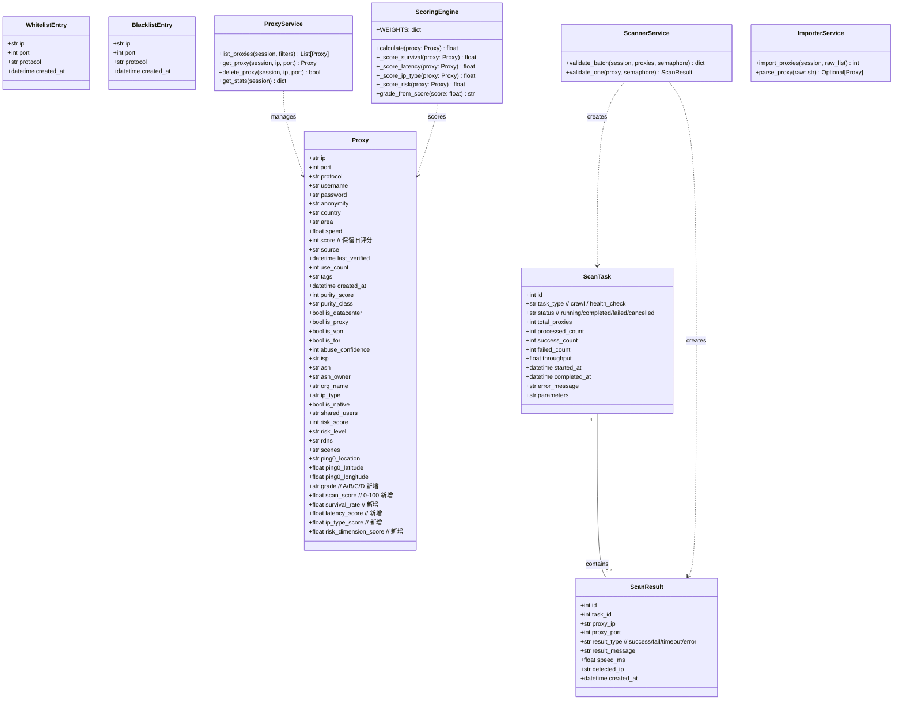
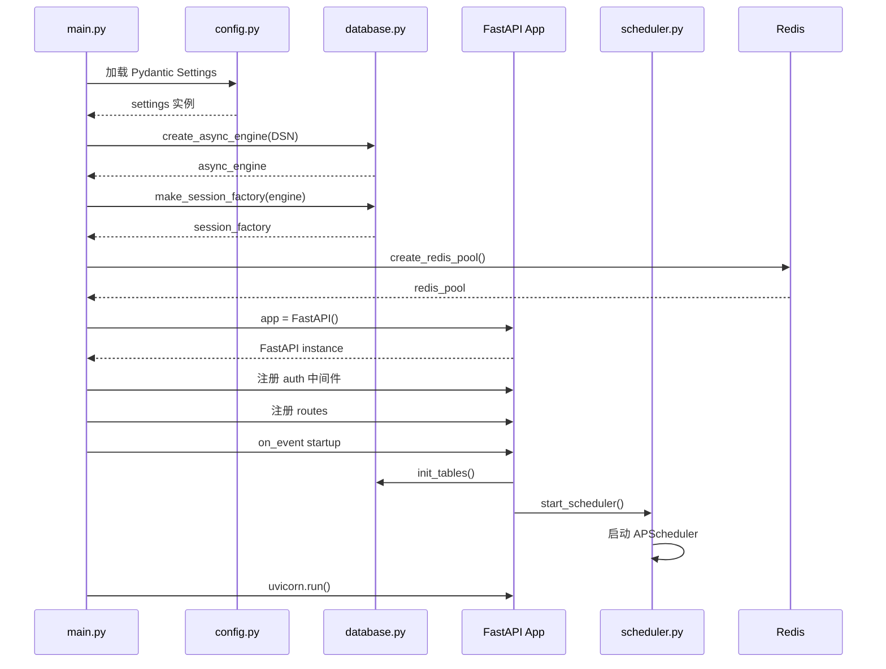
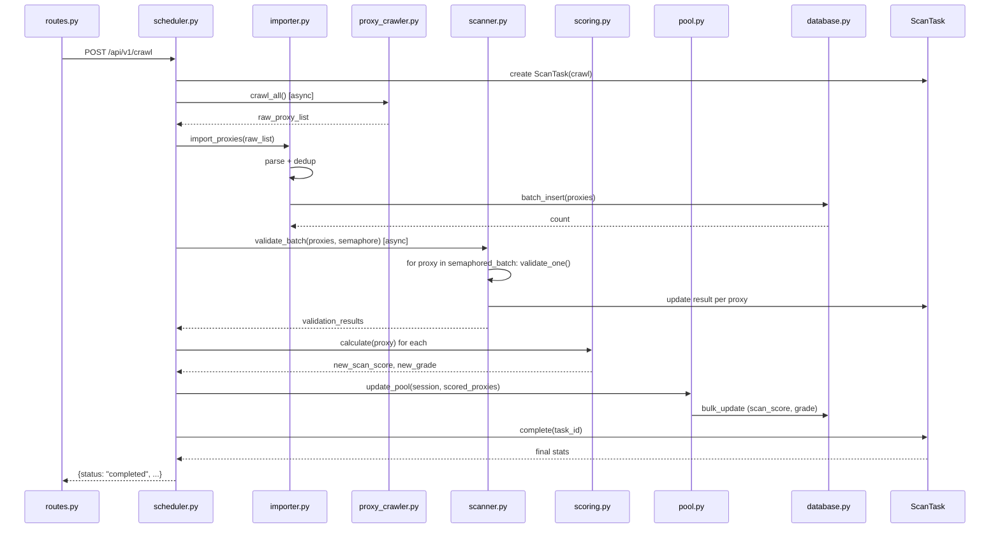
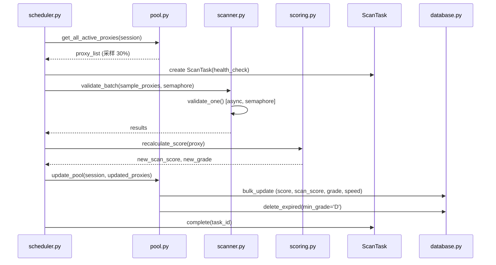
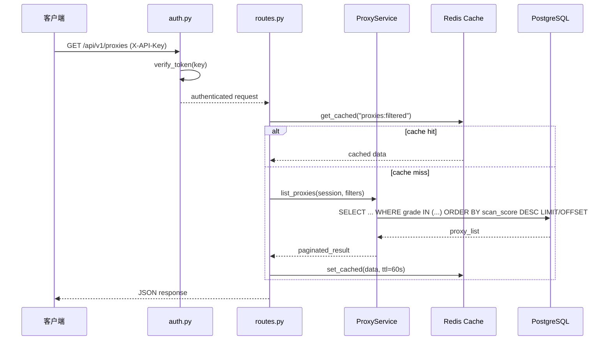
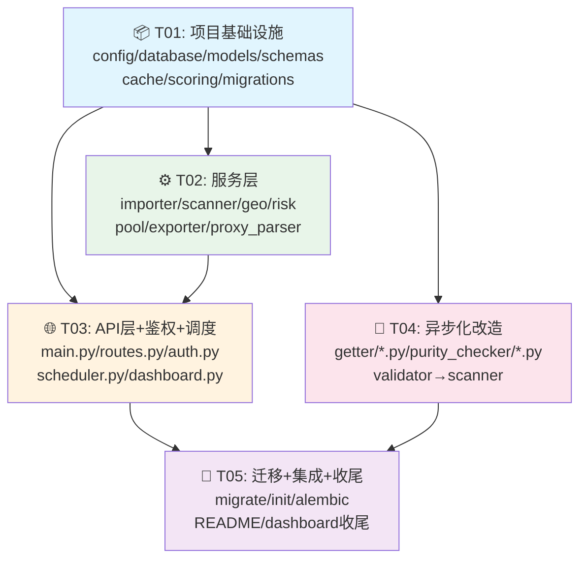

# PyProxyPool → Proxy Intelligence System 架构重构方案

> **作者**: Bob (Architect)
> **日期**: 2026-07-04
> **版本**: v1.0
> **目标**: 在现有 PyProxyPool 项目上原地重构，升级为完整的 Proxy Intelligence System

---

## 1. 实现方案

### 1.1 核心难点分析

| 难点 | 现状 | 目标 | 方案 |
|------|------|------|------|
| 数据库 | SQLite 单文件，并发写入差 | PostgreSQL 高并发 | asyncpg + SQLAlchemy 2.0 async ORM + Alembic 迁移 |
| 并发模型 | ThreadPoolExecutor (伪并发) | 真正异步并发 | asyncio + aiohttp + Semaphore + FastAPI |
| 评分系统 | 单一 score 字段 | 四维度加权评分 + 分级 | 新增 ScoringEngine，兼容旧 score |
| 单体架构 | main.py 580 行 | 分层架构 | API/Service/Repository 三层 |
| 鉴权 | 无 | X-API-Key SHA256 | 中间件 + Redis 缓存 Token |
| 向后兼容 | Dashboard WebSocket | 保持 Dashboard 不中断 | WebSocket 协议不变，API 路径兼容 |

### 1.2 技术选型

| 层级 | 选型 | 理由 |
|------|------|------|
| Web 框架 | **FastAPI** + **uvicorn[standard]** | 原生 async/await，自动 OpenAPI 文档 |
| ORM | **SQLAlchemy 2.0** (async) | 成熟生态，async 支持良好 |
| DB 驱动 | **asyncpg** | PostgreSQL 最快的 Python 驱动 |
| DB 迁移 | **Alembic** | 官方 SQLAlchemy 迁移工具 |
| 异步 HTTP | **aiohttp** | 轻量、性能优异 |
| 缓存 | **redis** (async) | 异步 Redis 客户端 |
| 配置 | **Pydantic Settings** | 类型安全 + 环境变量 |
| 调度 | **APScheduler** | 兼容现有，仅替换内部调用 |
| 日志 | **logging** (保留) | 零改动，SIGHUP 热重载继续 |

### 1.3 架构模式

采用 **API Gateway → Service Layer → Repository Layer** 三层架构：

```
                    ┌─────────────────────┐
                    │   FastAPI (main.py) │
                    │   ├ routes.py        │
                    │   ├ auth.py          │
                    │   └ scheduler.py     │
                    └─────────┬───────────┘
                              │
                    ┌─────────▼───────────┐
                    │   Service Layer      │
                    │   ├ importer.py      │
                    │   ├ scanner.py       │
                    │   ├ scoring.py       │
                    │   ├ pool.py          │
                    │   ├ geo.py           │
                    │   ├ risk.py          │
                    │   └ exporter.py      │
                    └─────────┬───────────┘
                              │
                    ┌─────────▼───────────┐
                    │  Repository Layer    │
                    │  ├ database.py       │
                    │  ├ cache.py          │
                    │  └ models.py (ORM)   │
                    └─────────┬───────────┘
                              │
                    ┌─────────▼───────────┐
                    │  PostgreSQL (asyncpg) │
                    └─────────────────────┘
```

---

## 2. 文件列表

### 2.1 完整目录结构

```
PyProxyPool/
├── main.py                        # [替换] FastAPI 入口（仅启动 + 生命周期管理）
├── config.py                      # [修改] Pydantic Settings 配置
├── models.py                      # [替换] SQLAlchemy ORM 模型
├── schemas.py                     # [新增] Pydantic request/response schemas
├── database.py                    # [新增] async engine + session factory
├── cache.py                       # [新增] Redis async 封装
├── scoring.py                     # [新增] 四维度评分引擎
├── pyproject.toml                 # [新增] 项目依赖声明
├── requirements.txt               # [删除] 由 pyproject.toml 替代
│
├── api/
│   ├── __init__.py                # [删除] 原 http.server 实现
│   ├── dashboard.py               # [修改] 更新 API 调用路径
│   ├── routes.py                  # [新增] REST API 路由
│   ├── auth.py                    # [新增] Token 鉴权中间件
│   └── scheduler.py               # [新增] APScheduler 定时任务（从 main.py 拆分）
│
├── services/                      # [新增] 服务层
│   ├── __init__.py
│   ├── importer.py                # [新增] 代理解析 + 去重 + 批量导入
│   ├── scanner.py                 # [新增] 存活检测 + 协议识别（异步重写）
│   ├── geo.py                     # [新增] 出口 IP 分析（异步化原 ip_geo）
│   ├── risk.py                    # [新增] IP 风险评估（保留并增强）
│   ├── pool.py                    # [新增] 代理池管理（分级 + 剔除）
│   └── exporter.py                # [新增] 多格式导出
│
├── utils/
│   ├── proxy_parser.py            # [新增] 代理解析器
│   └── ip_geo.py                  # [修改] 异步化
│
├── getter/                        # [修改] 适当异步化
│   ├── __init__.py
│   ├── github_sources.py          # [修改] 异步化
│   └── proxy_crawler.py           # [修改] 异步化
│
├── migrations/                    # [新增] Alembic 迁移
│   ├── env.py
│   └── versions/
│       └── 001_add_postgres.py
│
├── db/                            # [删除] 原数据库抽象层（被 models.py + database.py 替代）
│   ├── __init__.py                # [删除]
│   ├── base.py                    # [删除]
│   ├── sqlite_helper.py           # [删除]
│   ├── mysql_helper.py            # [删除]
│   └── redis_helper.py            # [删除]
│
├── validator/                     # [删除] 功能并入 services/scanner.py
│   └── __init__.py                # [删除]
│
├── purity_checker/                # [保留] 但改为 async 接口
│   ├── __init__.py                # [修改] 接口改为 async
│   └── providers.py               # [修改] 实现改为 async
│
├── scripts/                       # [新增] 运维脚本
│   ├── migrate_sqlite_to_postgres.py  # SQLite → PostgreSQL 数据迁移
│   └── init_db.py                  # 初始化数据库
│
├── data/                          # [保留] SQLite 数据文件
├── logs/                          # [保留] 日志目录
├── README.md                      # [修改] 更新文档
└── PRD_P1P2.md                    # [保留] 原始 PRD
```

### 2.2 文件状态总表

| 状态 | 文件数 | 说明 |
|------|--------|------|
| 🔴 删除 | 6 | db/ 整个目录、validator/ 整个目录、api/__init__.py、requirements.txt |
| 🟡 修改 | 7 | main.py、config.py、api/dashboard.py、getter/*.py、purity_checker/*.py、utils/ip_geo.py、README.md |
| 🟢 新增 | 22 | models.py、schemas.py、database.py、cache.py、scoring.py、pyproject.toml、api/*.py(3)、services/*.py(7)、utils/proxy_parser.py、migrations/*、scripts/*、services/__init__.py |

---

## 3. 数据模型设计

### 3.1 ORM 模型定义

```python
# models.py - SQLAlchemy 2.0 async ORM

class Proxy(Base):
    """代理IP - 兼容原 ProxyIP dataclass 所有字段 + 新增 grade/scan_score 字段"""
    __tablename__ = 'proxies'

    # === 主键 ===
    ip: Mapped[str] = mapped_column(String(45), primary_key=True)
    port: Mapped[int] = mapped_column(Integer, primary_key=True)

    # === 基础字段（与原 ProxyIP 兼容）===
    protocol: Mapped[str] = mapped_column(String(10), default='http', index=True)
    username: Mapped[str] = mapped_column(String(255), default='')
    password: Mapped[str] = mapped_column(String(255), default='')
    anonymity: Mapped[str] = mapped_column(String(20), default='unknown', index=True)
    country: Mapped[str] = mapped_column(String(50), default='', index=True)
    area: Mapped[str] = mapped_column(String(100), default='')
    speed: Mapped[float] = mapped_column(Float, default=0.0)
    score: Mapped[int] = mapped_column(Integer, default=10, index=True)  # 保留旧评分
    source: Mapped[str] = mapped_column(String(100), default='')
    last_verified: Mapped[datetime] = mapped_column(DateTime, default=func.now(), index=True)
    use_count: Mapped[int] = mapped_column(Integer, default=0)
    tags: Mapped[Optional[str]] = mapped_column(Text)  # JSON 数组字符串
    created_at: Mapped[datetime] = mapped_column(DateTime, default=func.now())

    # === 纯净度检测字段 ===
    purity_score: Mapped[int] = mapped_column(Integer, default=0)
    purity_class: Mapped[str] = mapped_column(String(50), default='')
    is_datacenter: Mapped[bool] = mapped_column(Boolean, default=False, index=True)
    is_proxy: Mapped[bool] = mapped_column(Boolean, default=False)
    is_vpn: Mapped[bool] = mapped_column(Boolean, default=False)
    is_tor: Mapped[bool] = mapped_column(Boolean, default=False)
    abuse_confidence: Mapped[int] = mapped_column(Integer, default=0)
    isp: Mapped[str] = mapped_column(String(255), default='')
    asn: M mapped[str] = mapped_column(String(50), default='')
    asn_owner: Mapped[str] = mapped_column(String(255), default='')
    org_name: Mapped[str] = mapped_column(String(255), default='')
    ip_type: Mmapped[str] = mapped_column(String(50), default='')
    is_native: Mapped[bool] = mapped_column(Boolean, default=False)
    shared_users: Mapped[str] = mapped_column(String(50), default='')
    risk_score: Mapped[int] = mapped_column(Integer, default=0)
    risk_level: Mapped[str] = mapped_column(String(20), default='')
    rdns: Mapped[str] = mapped_column(String(255), default='')
    scenes: Mapped[Optional[str]] = mapped_column(Text)
    ping0_location: Mapped[str] = mapped_column(String(100), default='')
    ping0_latitude: Mapped[float] = mapped_column(Float, default=0.0)
    ping0_longitude: Mapped[float] = mapped_column(Float, default=0.0)

    # === 新增：四维度评分字段 ===
    grade: Mapped[str] = mapped_column(String(1), default='D', index=True)  # A/B/C/D
    scan_score: Mapped[float] = mapped_column(Float, default=0.0, index=True)  # 0-100 加权评分
    survival_rate: Mapped[float] = mapped_column(Float, default=0.0)  # 存活率 0-1
    latency_score: Mapped[float] = mapped_column(Float, default=0.0)  # 延迟评分 0-100
    ip_type_score: Mapped[float] = mapped_column(Float, default=0.0)   # IP类型评分 0-100
    risk_dimension_score: Mapped[float] = mapped_column(Float, default=0.0)  # 风险评分 0-100


class ScanTask(Base):
    """扫描任务记录"""
    __tablename__ = 'scan_tasks'

    id: Mapped[int] = mapped_column(Integer, primary_key=True, autoincrement=True)
    task_type: Mapped[str] = mapped_column(String(20), default='crawl')  # crawl / health_check
    status: Mapped[str] = mapped_column(String(20), default='running', index=True)
    # running / completed / failed / cancelled
    total_proxies: Mapped[int] = mapped_column(Integer, default=0)
    processed_count: Mapped[int] = mapped_column(Integer, default=0)
    success_count: Mapped[int] = mapped_column(Integer, default=0)
    failed_count: Mapped[int] = mapped_column(Integer, default=0)
    throughput: Mapped[float] = mapped_column(Float, default=0.0)  # proxies/second
    started_at: Mapped[datetime] = mapped_column(DateTime, default=func.now(), index=True)
    completed_at: Mapped[Optional[datetime]] = mapped_column(DateTime)
    error_message: Mapped[Optional[str]] = mapped_column(Text)
    parameters: Mapped[Optional[str]] = mapped_column(Text)  # JSON 存储任务参数


class ScanResult(Base):
    """扫描详细结果"""
    __tablename__ = 'scan_results'

    id: Mapped[int] = mapped_column(Integer, primary_key=True, autoincrement=True)
    task_id: Mapped[int] = mapped_column(Integer, ForeignKey('scan_tasks.id'), index=True)
    proxy_ip: Mapped[str] = mapped_column(String(45), index=True)
    proxy_port: Mapped[int] = mapped_column(Integer)
    result_type: Mapped[str] = mapped_column(String(20))  # success / fail / timeout / error
    result_message: Mapped[Optional[str]] = mapped_column(Text)
    speed_ms: Mapped[float] = mapped_column(Float, default=0.0)
    detected_ip: Mapped[Optional[str]] = mapped_column(String(45))
    created_at: Mapped[datetime] = mapped_column(DateTime, default=func.now())

    # 关系
    task: Mapped[Optional[ScanTask]] = relationship('ScanTask', backref='results')


class WhitelistEntry(Base):
    __tablename__ = 'whitelist'
    ip: Mapped[str] = mapped_column(String(45), primary_key=True)
    port: Mapped[int] = mapped_column(Integer, primary_key=True)
    protocol: Mapped[str] = mapped_column(String(10), default='http')
    created_at: Mapped[datetime] = mapped_column(DateTime, default=func.now())


class BlacklistEntry(Base):
    __tablename__ = 'blacklist'
    ip: Mapped[str] = mapped_column(String(45), primary_key=True)
    port: Mapped[int] = mapped_column(Integer, primary_key=True)
    protocol: Mapped[str] = mapped_column(String(10), default='http')
    created_at: Mapped[datetime] = mapped_column(DateTime, default=func.now())
```

### 3.2 Mermaid 类图



---

## 4. 程序调用流程

### 4.1 启动流程



### 4.2 采集流程（异步）



### 4.3 健康检查流程



### 4.4 API 查询流程



---

## 5. 评分系统详细设计

### 5.1 四维度加权评分

| 维度 | 权重 | 计算方法 | 输出范围 |
|------|------|----------|----------|
| **存活率** | 40% | `1 - (failed_attempts / total_attempts)` | 0.0 ~ 1.0 → ×100 |
| **延迟** | 20% | `max(0, 100 - min(speed_ms, 5000) / 50)` | 0 ~ 100 |
| **IP类型** | 20% | 住宅=100, 数据清洁=80, 数据中心=50, 代理/VPN=20, Tor=0 | 0 ~ 100 |
| **风险** | 20% | `max(0, 100 - risk_score - abuse_confidence * 0.5)` | 0 ~ 100 |

```
final_scan_score = survival * 40 + latency_score * 0.2 + ip_type_score * 0.2 + risk_score * 0.2
```

### 5.2 分级规则

| 等级 | scan_score 范围 | 含义 | 使用策略 |
|------|-----------------|------|----------|
| **A** | ≥ 80 | 优质代理 | 优先使用，高频轮换 |
| **B** | 60 ~ 79 | 良好代理 | 正常使用 |
| **C** | 40 ~ 59 | 可用代理 | 降级使用 |
| **D** | < 40 | 低质量代理 | 标记剔除，不主动使用 |

### 5.3 旧数据兼容

- 旧 `score` 字段保持不变，作为历史参考
- 新 `scan_score` 在数据导入/验证后自动计算
- Dashboard 查询时返回两个字段，前端可切换显示

---

## 6. SQLite → PostgreSQL 迁移方案

### 6.1 迁移策略

采用 **"导出 → 转换 → 导入"** 三阶段迁移：

```
Phase 1: 导出 SQLite 数据为 CSV
  ├─ 使用 sqlite3 命令行导出所有表
  └─ 保留 data/proxy.db 备份

Phase 2: 数据转换
  ├─ 类型映射: TEXT → VARCHAR, REAL → FLOAT
  ├─ 时间戳: Unix float → TIMESTAMP
  ├─ 新字段初始化: grade='D', scan_score=0.0
  ├─ 从旧 score 反算初版 scan_score（近似）

Phase 3: 导入 PostgreSQL
  ├─ 创建数据库 + 用户
  ├─ 运行 Alembic 迁移建表
  ├─ COPY FROM CSV 批量导入
  └─ 创建索引
```

### 6.2 迁移脚本

```python
# scripts/migrate_sqlite_to_postgres.py

import asyncio
import sqlite3
import csv
import os

# 1. 从 SQLite 导出
def export_sqlite(sqlite_path, output_dir):
    conn = sqlite3.connect(sqlite_path)
    tables = ['proxies', 'whitelist', 'blacklist', 'proxy_history']
    for table in tables:
        rows = conn.execute(f'SELECT * FROM {table}').fetchall()
        cols = [d[1] for d in conn.execute(f'PRAGMA table_info({table})').fetchall()]
        with open(f'{output_dir}/{table}.csv', 'w', newline='') as f:
            writer = csv.writer(f)
            writer.writerow(cols)
            writer.writerows(rows)
    conn.close()

# 2. 转换并导入 PostgreSQL
async def import_postgres(dsn, csv_dir):
    from database import create_async_engine, create_session_factory
    engine = create_async_engine(dsn)
    async with engine.begin() as conn:
        # COPY 批量导入
        for table in ['proxies', 'whitelist', 'blacklist']:
            csv_path = f'{csv_dir}/{table}.csv'
            if os.path.exists(csv_path):
                with open(csv_path) as f:
                    await conn.execute(
                        text(f"COPY {table} FROM STDIN WITH CSV HEADER")
                    )
    engine.dispose()
```

---

## 7. 任务列表（按实现顺序）

### T01: 项目基础设施

**描述**: 建立新架构的底层基础设施 — 配置、数据库、模型、缓存、评分引擎

| 文件 | 操作 | 说明 |
|------|------|------|
| `pyproject.toml` | 新增 | 项目元数据 + 依赖声明 |
| `requirements.txt` | 删除 | 由 pyproject.toml 替代 |
| `config.py` | 修改 | Pydantic Settings 替代原常量配置 |
| `database.py` | 新增 | asyncpg engine + session factory |
| `models.py` | 替换 | SQLAlchemy ORM 模型（原 dataclass 替代） |
| `schemas.py` | 新增 | Pydantic request/response schemas |
| `cache.py` | 新增 | Redis async 封装 |
| `scoring.py` | 新增 | 四维度评分引擎 |
| `migrations/env.py` | 新增 | Alembic 环境配置 |
| `migrations/versions/001_add_postgres.py` | 新增 | PostgreSQL 表结构迁移 |

**依赖**: 无（第一个任务）
**优先级**: P0

---

### T02: 服务层

**描述**: 构建核心业务服务 — 导入、扫描、评分、池管理、地理、风险、导出

| 文件 | 操作 | 说明 |
|------|------|------|
| `services/__init__.py` | 新增 | 包初始化 |
| `services/importer.py` | 新增 | 代理解析 + 去重 + 批量导入 |
| `services/scanner.py` | 新增 | 异步存活检测 + 协议识别 |
| `services/geo.py` | 新增 | 出口 IP 地理分析（原 ip_geo.py 异步化） |
| `services/risk.py` | 新增 | IP 风险评估（保留增强原 purity_checker） |
| `services/pool.py` | 新增 | 代理池分级管理 + 剔除 |
| `services/exporter.py` | 新增 | 多格式导出 (txt/json/csv) |
| `utils/proxy_parser.py` | 新增 | 代理解析器 |

**依赖**: T01 (需要 models.py, database.py, scoring.py)
**优先级**: P0

---

### T03: API 层 + 鉴权 + 调度

**描述**: 构建 FastAPI 入口、路由、Token 鉴权、定时调度器（从原 main.py 拆分）

| 文件 | 操作 | 说明 |
|------|------|------|
| `main.py` | 替换 | FastAPI 入口（精简，仅生命周期管理） |
| `api/routes.py` | 新增 | REST API 路由（从原 api/__init__.py 迁移 + 扩展） |
| `api/auth.py` | 新增 | X-API-Key SHA256 鉴权 |
| `api/scheduler.py` | 新增 | APScheduler 定时任务（从原 main.py run_scheduler() 迁移） |
| `api/dashboard.py` | 修改 | 更新 API 调用路径，保持 Dashboard 不中断 |

**依赖**: T01 (需要 database.py, schemas.py), T02 (需要 services/*.py)
**优先级**: P0

---

### T04: 异步化改造

**描述**: 将现有模块异步化 — 采集器、验证器、纯净度检测、地理查询

| 文件 | 操作 | 说明 |
|------|------|------|
| `getter/github_sources.py` | 修改 | 改为 async 接口，使用 aiohttp |
| `getter/proxy_crawler.py` | 修改 | 改为 async 接口，使用 aiohttp |
| `validator/__init__.py` | 删除 | 功能并入 T02 的 scanner.py |
| `purity_checker/__init__.py` | 修改 | 改为 async 接口 |
| `purity_checker/providers.py` | 修改 | 改为 async 实现 |
| `utils/ip_geo.py` | 修改 | 改为 async 接口，由 services/geo.py 封装 |

**依赖**: T01 (需要 config.py settings, aiohttp)
**优先级**: P1（可与 T03 并行）

---

### T05: 迁移 + 集成 + 收尾

**描述**: 数据迁移脚本、向后兼容验证、最终集成测试

| 文件 | 操作 | 说明 |
|------|------|------|
| `scripts/migrate_sqlite_to_postgres.py` | 新增 | SQLite → PostgreSQL 数据迁移脚本 |
| `scripts/init_db.py` | 新增 | 数据库初始化 + 迁移命令封装 |
| `migrations/alembic.ini` | 新增 | Alembic 配置文件 |
| `README.md` | 修改 | 更新文档 |
| `api/dashboard.py` | 修改（收尾） | 确认 WebSocket 兼容 |

**依赖**: T01, T02, T03, T04 全部完成
**优先级**: P1

---

## 8. 共享知识

### 8.1 跨文件约定

| 约定 | 说明 |
|------|------|
| **日期格式** | 数据库中所有时间使用 PostgreSQL `TIMESTAMP`，Pydantic schema 中使用 `datetime` |
| **JSON 字段** | `tags`、`scenes`、`parameters` 以 JSON 字符串存储，读写时使用 `json.dumps()/json.loads()` |
| **布尔值** | 数据库中 `Boolean` 类型（PostgreSQL 原生），不再使用 0/1 整型 |
| **分页** | 统一使用 offset/limit 分页，最大 limit=100 |
| **评分兼容** | 旧 `score` 字段保留只读，新 `scan_score` 是主要评分字段 |
| **错误处理** | API 返回统一格式 `{code: int, message: str, data: any}` |
| **日志级别** | 保持与原系统一致：DEBUG/INFO/WARNING/ERROR |
| **SIGHUP 热重载** | 保留原 SIGHUP 配置热重载逻辑，改为 reload Pydantic Settings |

### 8.2 向后兼容性保证

| 接口 | 兼容性策略 |
|------|-----------|
| **Dashboard HTML** | 完全保留原 dashboard.py 中的 HTML 字符串 |
| **WebSocket** | `/ws` 端点路径不变，消息格式不变 |
| **REST API 路径** | 旧路径 (`/stats`, `/proxy/all`, `/export` 等) 通过 routes.py 兼容转发 |
| **新 API** | 统一前缀 `/api/v1/`，旧路径不冲突 |
| **配置文件** | config.py 保留所有环境变量读取逻辑，Pydantic Settings 兼容 |
| **日志文件** | logs/proxypool.log 路径不变 |
| **SIGHUP** | 信号处理逻辑从 main.py 迁移到 FastAPI lifespan |

### 8.3 API Key 鉴权细节

```
# 请求头格式
X-API-Key: <sha256_hex(api_key_raw)>

# 验证流程
1. 接收 X-API-Key 头
2. 从 Redis 缓存查询 key hash → raw key
3. 如果缓存未命中，从 PostgreSQL 用户表查询
4. 验证通过后返回用户信息
5. Redis 缓存 TTL=3600s
```

### 8.4 异步并发控制

```python
# 使用 asyncio.Semaphore 控制并发
semaphore = asyncio.Semaphore(MAX_CONCURRENCY)

async def validate_one(proxy, semaphore):
    async with semaphore:
        # 实际验证逻辑
        result = await check_proxy(proxy)
        return result
```

---

## 9. 待明确事项

| 事项 | 问题 | 建议 |
|------|------|------|
| PostgreSQL 部署 | 用户是否有 PostgreSQL 实例？Docker？ | 假设用户使用 Docker Compose 部署本地 PostgreSQL |
| Redis 可用性 | Redis 用于 Token 缓存 + 限流，是否已部署？ | 假设与 PostgreSQL 同 Docker Compose |
| 迁移数据量 | 当前 SQLite 数据量？ | 从现有代码推断，规模 < 10 万条，迁移脚本处理足够 |
| 生产环境 | 部署方式？ | 建议 Docker Compose 一键启动 |
| WebSocket 实现 | 原 api/__init__.py 使用 http.server，没有真正 WebSocket | 确认 Dashboard 是否真的用了 WebSocket，还是 HTTP 轮询 |
| APScheduler 版本 | 当前版本？ | 使用 APScheduler 3.x，兼容 asyncio 事件循环 |

---

## 10. 依赖包列表

```toml
# pyproject.toml

[project]
name = "proxypool"
version = "3.0.0"
description = "Proxy Intelligence System - Async Proxy Pool with Scoring & Grading"
requires-python = ">=3.10"
dependencies = [
    # Web
    "fastapi>=0.104.0",
    "uvicorn[standard]>=0.24.0",
    "pydantic>=2.5.0",
    "pydantic-settings>=2.1.0",

    # Database
    "sqlalchemy[asyncio]>=2.0.23",
    "asyncpg>=0.29.0",
    "alembic>=1.13.0",

    # Async HTTP
    "aiohttp>=3.9.0",
    "aiofiles>=23.2.0",

    # Cache
    "redis[hiredis]>=5.0.0",

    # Scheduler
    "apscheduler>=3.10.4",

    # HTML Parsing
    "lxml>=4.9.0",

    # Legacy compatibility
    "requests[socks]>=2.28.0",

    # Utilities
    "cachetools>=5.3.0",
]

[project.optional-dependencies]
dev = [
    "pytest>=7.4.0",
    "pytest-asyncio>=0.21.0",
    "httpx>=0.25.0",
]

[build-system]
requires = ["setuptools>=61.0"]
build-backend = "setuptools.build_meta"
```

---

## 11. 任务依赖图



**执行顺序建议**:
1. **T01** → 建立基础设施
2. **T02 + T04** → 并行执行（服务层 + 异步化改造）
3. **T03** → 依赖 T01 + T02
4. **T05** → 依赖全部前置任务